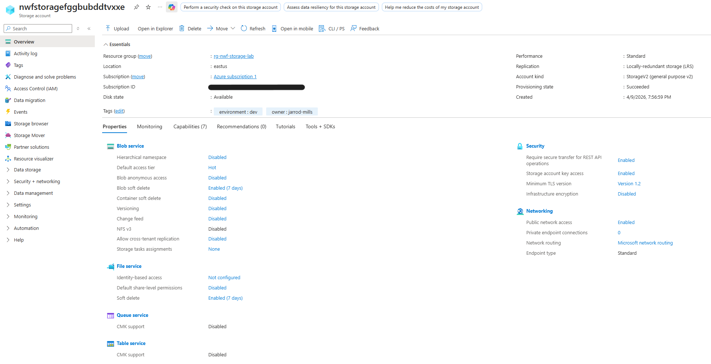
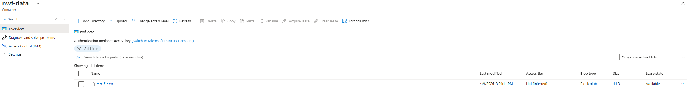
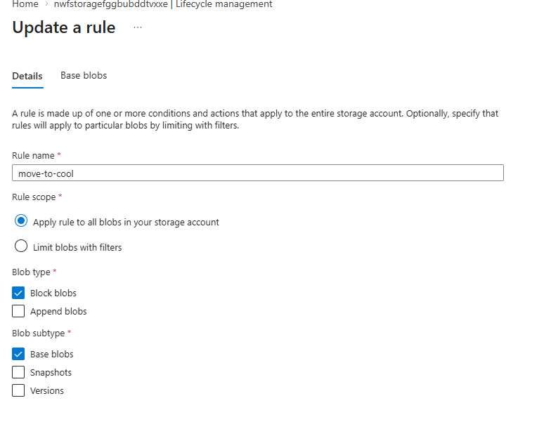

# Azure Storage Lab

## What I Built
Deployed an Azure Storage Account using Bicep with blob containers, lifecycle 
management policies, and security hardening. Used PowerShell to upload and 
manage blobs after deployment.

## Resources Deployed
- **Storage Account** — Standard LRS, StorageV2, Hot access tier
- **Blob Service** — Enabled with 7 day soft delete for accidental deletion recovery
- **Blob Container** — Private container named nwf-data with no public access
- **Lifecycle Policy** — Automatically moves blobs to Cool after 30 days and Archive after 90 days
- **Resource Tags** — environment and owner tags applied

## Security Configuration
- HTTPS only — HTTP connections blocked
- Minimum TLS 1.2 — Older insecure versions blocked
- Blob public access disabled — No anonymous access allowed
- Soft delete enabled — Deleted blobs recoverable for 7 days

## Lifecycle Policy
Data is automatically tiered to reduce costs over time:

| Age | Tier | Cost |
|-----|------|------|
| 0-30 days | Hot | Higher storage, lower access cost |
| 30-90 days | Cool | Lower storage, higher access cost |
| 90+ days | Archive | Lowest storage, highest access cost |

## PowerShell Commands Used
After deployment, PowerShell was used to manage the storage account:

Get storage account context:
$storageAccount = Get-AzStorageAccount -ResourceGroupName "rg-nwf-storage-lab" -StorageAccountName "your-storage-account"
$ctx = $storageAccount.Context

Upload a file to blob storage:
Set-AzStorageBlobContent -File "test-file.txt" -Container "nwf-data" -Blob "test-file.txt" -Context $ctx

List blobs in container:
Get-AzStorageBlob -Container "nwf-data" -Context $ctx

Verify lifecycle policy:
Get-AzStorageAccountManagementPolicy -ResourceGroupName "rg-nwf-storage-lab" -StorageAccountName "your-storage-account"

## What I Learned
- How Azure Storage access tiers work and when to use Hot vs Cool vs Archive
- How lifecycle policies automatically move data to cheaper tiers based on age
- How soft delete protects against accidental blob deletion
- How to use PowerShell Az module to manage Azure Storage resources
- PowerShell verb-noun command pattern for Azure management
- How to enforce security settings like HTTPS only and minimum TLS version through Bicep

## Tools Used
- Azure Bicep
- Azure CLI
- Azure PowerShell
- Azure Cloud Shell
- Azure Portal

## How to Deploy
1. Open Azure Cloud Shell
2. Upload main.bicep
3. Run:

az group create --name rg-nwf-storage-lab --location eastus

az deployment group create --name nwf-storage-deploy --resource-group rg-nwf-storage-lab --template-file main.bicep

## Screenshots

### Storage Account Overview

### Blob Container with Uploaded File

### Lifecycle Management Policy

